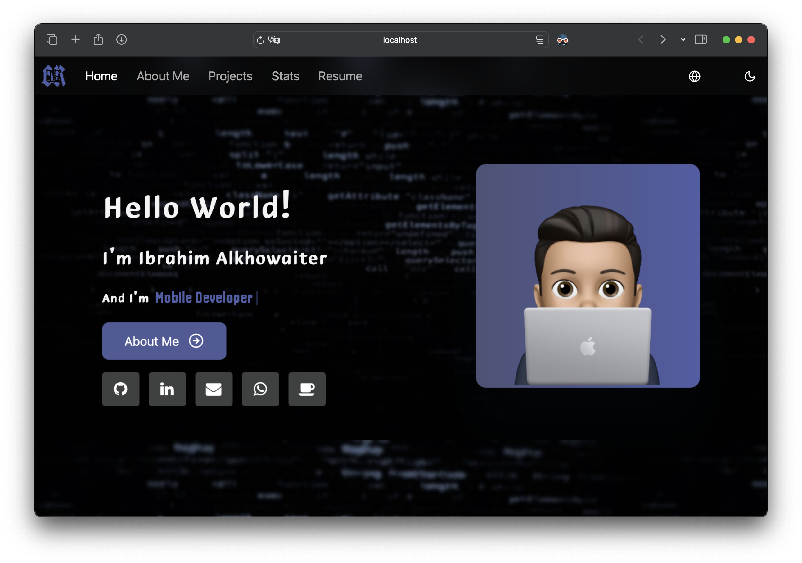

# My portfolio

## Overview

This is my updated Portfolio, created using React Native Web, Expo, Nativewind, gluestack-ui and several npm packages, you can use its templates for personal purposes only.

## Installation

1. Clone the repository to your local machine:

   ```bash
   git clone https://github.com/BR19-gh/br19-portifolio.git
   ```

2. Navigate to the project directory:

   ```bash
   cd br19-portifolio
   ```

3. Install dependencies:

   ```bash
   npm install
   ```

## Usage

1. Start the development server:

   ```bash
   npx expo start --web
   ```

2. Open your browser and visit [http://localhost:8081](http://localhost:8081) to use the Employee Polls Web App.

## Folder Structure

- `app`: The web app views
- `app/(tabs)`: The web app screens
- `components`: Contains React components
- `constants`: Web app constants
- `contexts`: Web app contexts
- `hooks`: Web app custom hooks
- `assets`: Public assets
- `services`: Web app external services

## Sample Screenshots

### Home Page



<hr>
<div id="header" align="center">
  
  <br><br>
  <div id="badges">
  <a href="https://br19.me">
    
  </a>
    <a href="https://www.linkedin.com/in/ibrahim-alkhowaiter-430b24203/">
    
  </a>
  <a href="https://stackoverflow.com/users/16627404/br19-so">
    
  </a>
    
</div>
</div>

<br>

## About me 🔎:

- My Name is Ibrahim Alkhowaiter 🏷️👤.

- FullStack and Mobile Apps Developer 💻🌐.

- FullStack and Software Developer 💻🌐.

- Live in Unaizah - Riyadh, KSA 🌴🇸🇦.

<div>
